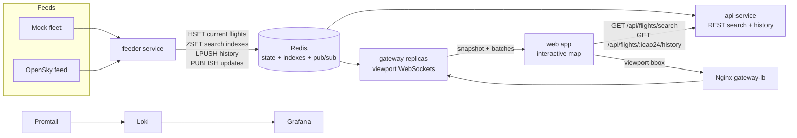

# Contrail


A real-time aircraft radar lab with viewport-aware WebSockets, Redis-backed flight state, and a fast map UI.

Contrail streams live-looking aircraft positions into Redis, fans them out through a spatially aware WebSocket gateway, and renders them on an interactive browser map. It can run entirely from a deterministic mock fleet for development, or ingest OpenSky data when credentials are available.

## Why It Is Cool

- **Live radar feel**: aircraft move continuously on a map with counts, update status, search, and per-aircraft detail panels.
- **Viewport-aware streaming**: clients send their current bounding box and receive only aircraft inside the relevant grid cells.
- **Redis as the flight board**: current aircraft, search indexes, last-seen cleanup, history, and pub/sub all share one fast data plane.
- **Scale-shaped locally**: the gateway can run behind an Nginx load balancer with multiple replicas.
- **Observability included**: Grafana, Loki, and Promtail are wired into Docker Compose.
- **Testable pressure points**: k6 scripts cover the API and gateway paths.

## Architecture



## Monorepo Map

| Path | Purpose |
| --- | --- |
| `apps/web` | Vite map client and browser UI |
| `services/feeder` | Polls mock/OpenSky feeds and writes flight events to Redis |
| `services/gateway` | Fastify WebSocket gateway with grid-cell routing and batching |
| `services/api` | Fastify REST API for snapshots, search, single aircraft, and history |
| `packages/shared` | Shared wire types, constants, and message encode/decode helpers |
| `packages/feed-mock` | Deterministic synthetic fleet generator |
| `packages/feed-opensky` | OpenSky-backed feed implementation |
| `packages/logger` | Shared structured logger |
| `k6` | Load-test scenarios |
| `observability` | Grafana, Loki, and Promtail config |

## Quick Start

Requirements:

- Bun `1.3.13`
- Docker and Docker Compose

Install dependencies:

```sh
bun install
```

Run the local development stack with Redis plus all workspace dev scripts:

```sh
make dev
```

Run the full containerized stack:

```sh
make up
```

Then open:

- Web app: `http://localhost:5173`
- Gateway: `ws://localhost:3001/ws`
- API health: `http://localhost:3002/health`
- Grafana: `http://localhost:3000` using `admin` / `admin`

Stop the containerized stack:

```sh
make down
```

## Data Flow

1. The feeder fetches a batch of `FlightEvent` records from either the mock fleet or OpenSky.
2. Redis stores current state by `icao24`, search indexes by callsign and ICAO24, recent history, and last-seen timestamps.
3. The feeder publishes every updated aircraft on the Redis channel.
4. The gateway subscribes to Redis, batches updates, and routes them to WebSocket clients by viewport grid cells.
5. The web app sends viewport changes, receives snapshots and batches, updates markers, and uses the REST API for search/history.

## OpenSky Mode

By default, Contrail uses the mock feed. To use OpenSky in Docker Compose, provide:

```sh
OPENSKY_CLIENT_ID=...
OPENSKY_CLIENT_SECRET=...
```

The feeder switches to `@contrail/feed-opensky` when `OPENSKY_CLIENT_ID` is present.

## Useful Commands

```sh
make dev          # Redis + local dev processes
make dev-observe  # Observability services + local dev processes
make up           # Full Docker Compose stack
make down         # Stop Docker Compose stack
make build        # Build all workspaces through Turbo
make load-test    # Build and run k6 scenarios
```

## API

```http
GET /api/flights
GET /api/flights/search?q=CONTRAIL1111
GET /api/flights/:icao24
GET /api/flights/:icao24/history
GET /health
```

## WebSocket

Connect to `/ws`, then send viewport messages:

```json
{
  "type": "viewport",
  "bbox": {
    "latMin": 40,
    "latMax": 55,
    "lonMin": -5,
    "lonMax": 15
  }
}
```

The gateway responds with `snapshot` messages for the current viewport and `batch` messages for live updates.

## License

MIT
